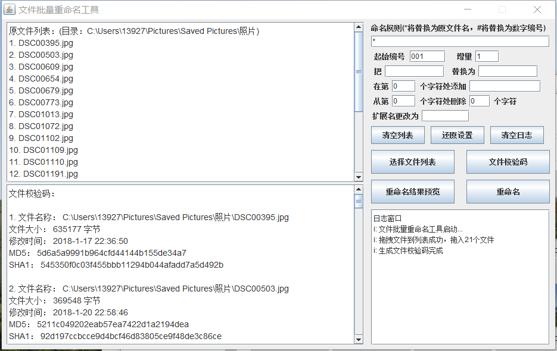
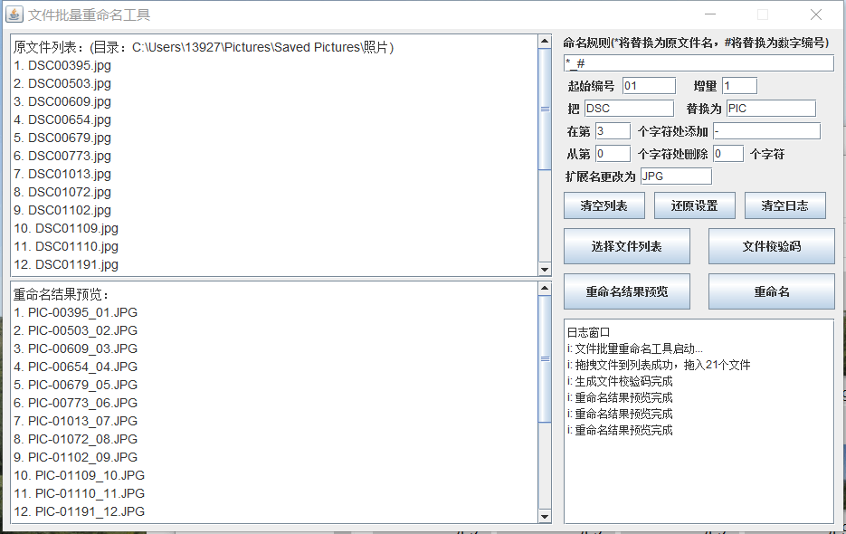

# JavaFilesRename
java桌面工具：文件批量重命名、批量生成校验码工具

#### 用法：
* 1.电脑安装有java环境并且配置好java相关环境变量；
* 2.下载“批量文件重命名工具.zip”，解压；
* 3.双击startup.bat启动应用，将文件拖入原文件列表框中，然后按照提示生成校验码或重命名即可(重命名操作前请先进行重命名结果预览，确定无误后再做重命名操作)；

